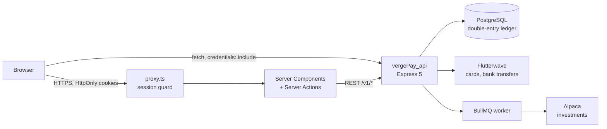
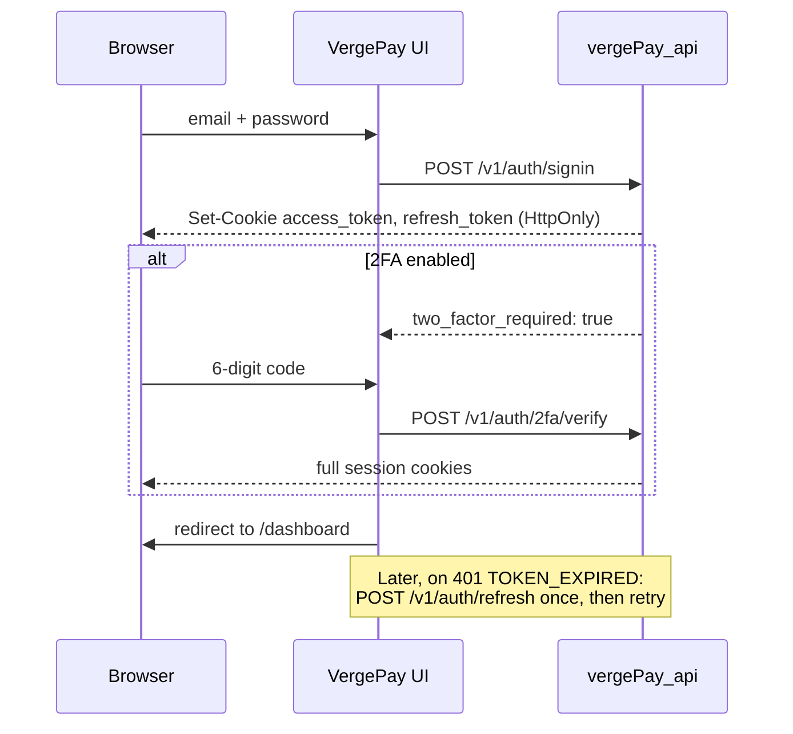

# VergePay UI

**The web dashboard for VergePay, a fintech platform for Nigerian freelancers and small businesses. One screen shows personal and business money side by side: wallets, invoices, recurring billing, client payment health, expenses, payroll, savings goals and budget envelopes.**


Built by **[Seyitan Omodara](https://github.com/dunascode-prog)** · Backend: [vergePay_api](https://github.com/dunascode-prog/vergePay_api)

> **Project status.** All 10 sections of the app (16 routes) are designed and built. Sign-up and sign-in call the real API. The other screens still show realistic sample data while they're connected to the backend one feature at a time; see [Connecting to the API](#connecting-to-the-api). The backend is finished and tested: 56 endpoints and 664 passing Postman assertions.

---

## At a glance

| | |
|---|---|
| **What it is** | A dashboard for freelancers and small businesses to run personal and business money in one place |
| **Screens** | 16 routes in 10 sections: overview, analytics, invoices (list, new, detail, edit, reminder), recurring billing, clients, business overview, expenses, payroll, goals, envelopes |
| **Stack** | Next.js 16 (App Router), React 19, TypeScript, Tailwind CSS 4, shadcn/ui on Base UI, Recharts, React Hook Form + Zod |
| **Rendering** | Server Components by default. Client Components only where there's interaction. Server Actions for forms |
| **Money** | Naira and US dollars kept separate and never blended at an invented exchange rate. Formatted per locale with `Intl.NumberFormat` |
| **Auth model** | HttpOnly cookie sessions set by the API. The browser's JavaScript never holds a token. Refresh and route guarding are handled for you |
| **Backend** | [vergePay_api](https://github.com/dunascode-prog/vergePay_api): Express 5 + PostgreSQL, with a double-entry ledger, Flutterwave payments, TOTP 2FA and Alpaca investments |

---

## Why VergePay

A Nigerian freelancer usually has a personal account, a business account, a few clients who pay late, retainers that renew every month, and a spreadsheet trying to hold it all together. Banking apps show balances. They don't answer the questions that matter:

- *Who owes me money, and are they likely to pay on time?*
- *How much of this month's income is actually mine after expenses, tax and savings?*
- *Is my business healthier than it was three months ago?*

VergePay answers those on one screen. This repository is that screen. The backend moves the money; this app turns it into decisions.

---

## Screens

The sidebar groups the app the way a small-business owner thinks about their money.

### Main
| Screen | Route | What it shows |
|---|---|---|
| **Overview** | `/dashboard` | A performance card (income, spent, net, investment rate, each with a trend sparkline) that switches between **Personal / Business / Combined**. Also: wallet balances, a client health breakdown (excellent / stable / at risk), an AI summary, upcoming billing (auto-send retainers and auto-debits), savings goals and outstanding invoices |
| **Analytics** | `/dashboard/analytics` | Revenue trend, client revenue share and concentration risk, cash-flow forecast, collection metrics, late-payment ageing, how effective reminders are, and a feed of AI insights. Filter by this month, the last 3 months or this year |

### Payments
| Screen | Route | What it shows |
|---|---|---|
| **Invoices** | `/dashboard/invoices` | Filterable table of draft, sent, partial, paid and overdue invoices. Each has a **predicted chance of on-time payment** and the client's health score |
| **New / edit invoice** | `/dashboard/invoices/new`, `/[id]/edit` | Invoice form with client, description, amount, currency, and issue and due dates |
| **Invoice detail** | `/dashboard/invoices/[id]` | Status, amount paid so far, payment history and the ledger entries behind the invoice |
| **Send reminder** | `/dashboard/invoices/[id]/remind` | Compose a payment reminder for an unpaid invoice |
| **Recurring billing** | `/dashboard/recurring`, `/new`, `/[id]` | Retainers and subscriptions: pause, resume or cancel, next billing date, invoices generated, and the monthly equivalent of weekly, quarterly and yearly plans |
| **Clients** | `/dashboard/clients` | Client cards with health score, average days to pay, on-time rate, total revenue, and VIP and new tags. A detail sheet and an AI note on each client |

### Business
| Screen | Route | What it shows |
|---|---|---|
| **Business overview** | `/dashboard/business` | A business health score and the factors behind it, a ledger snapshot (cash, receivables, revenue and expenses year to date), revenue vs. expenses, top clients, recurring revenue, and a **"needs attention"** list that links straight to the problem |
| **Expenses** | `/dashboard/expenses` | Expense table with category breakdown and trend. Flags recurring expenses and **missing receipts** |
| **Payroll** | `/dashboard/payroll` | Payees (salary or contract), pay frequency and bank details (masked). A payroll run shows gross, PAYE, pension and net, and writes each payment to Expenses automatically |

### Wealth
| Screen | Route | What it shows |
|---|---|---|
| **Goals** | `/dashboard/goals` | Savings goals with progress, contributions, and a **pace check** that says whether you'll hit the deadline at your current rate |
| **Envelopes** | `/dashboard/envelopes` | Budget envelopes that you fund from and withdraw back into your wallets, with spent and remaining amounts for each |

Every feature page follows the same layout: a header with actions, summary cards, the main grid or table, an "add" dialog, and an AI insight banner. Once you've used one page, you know how to use them all.

---

## Engineering highlights

### Server-first rendering
Pages are **React Server Components** by default. They read their data on the server and send finished HTML, so the dashboard's charts and tables don't wait on a client-side fetch. Components are marked `"use client"` only where there's real interaction: toggles, dialogs, forms and charts. Mutations such as creating a client, logging an expense, running payroll or pausing a plan are **Server Actions** (`app/(protected)/dashboard/*/actions.ts`). They refresh only the page they changed.

### A security model that keeps tokens away from JavaScript
The API issues the session as **HttpOnly, `SameSite=Strict` cookies**, so no script on the page, including an injected one, can read the access or refresh token.
- The UI sends requests with `credentials: "include"` and stores nothing itself: no `localStorage` and no token in React state.
- **Refresh is automatic:** `lib/api.ts` calls `/v1/auth/refresh` once and retries when a request fails with an expired session. The API rotates refresh tokens and allows each one to be used only once.
- **`proxy.ts`** (Next.js 16's replacement for middleware) runs before any `/dashboard` route renders, and sends visitors without a session to `/signin`.
- **Two-factor sign-in:** the API's TOTP 2FA gives a limited session until the code is verified, and the sign-in flow gets a code step to match.

The route guard and the 2FA step are the part being connected now (see [Connecting to the API](#connecting-to-the-api)).

### Money shown honestly
Totals in different currencies are **never added together**. A client paying ₦620,000 and $1,400 is shown as `₦620,000 + $1,400`, not as a single naira figure based on a guessed exchange rate (`lib/format.ts`). Amounts use locale formatting (`en-NG`, `en-US`). The API stores all money as integer minor units (kobo and cents), so no floating-point error ever reaches the screen.

### Forms that validate before the round trip
Forms use **React Hook Form with Zod schemas** whose rules match the API's. For example, sign-up requires a password of at least 12 characters with mixed character types, plus a matching confirmation. Mistakes show up right away, next to the field. When the API rejects a field anyway, its structured error (`error.field`) is shown on that input rather than as a generic toast.

### A typed domain model
Every concept on screen has a TypeScript type in `types/`: `Invoice`, `ClientProfile`, `RecurringPlan`, `Expense`, `Payee` and `PayrollPayment`, `Goal`, `Envelope`, `LedgerSnapshot`, and the analytics series. Invoices carry their own ledger entries and payment records, matching how the backend's double-entry ledger records them. Replacing the sample data with API responses is then a change of data source, not a redesign.

### Business rules kept out of components
Calculations live in small, pure modules in `lib/` rather than inside JSX:
- `recurring-math.ts`: the monthly equivalent of any billing frequency
- `goal-pace.ts`: whether a goal is on track for its deadline at the current contribution rate
- `expense-category.ts`: category totals from line items, with colours shared across Analytics, Business and Expenses so a category looks the same everywhere
- `format.ts`: currency formatting and per-currency sums

### Accessible components, dark mode
The UI is built on **shadcn/ui over Base UI** primitives, so dialogs, dropdowns, sheets, tabs and tooltips handle focus, keyboard navigation and ARIA roles properly. The theme is made of CSS variables in Tailwind 4, with light and dark modes via `next-themes`. The sidebar collapses, remembers its state in a cookie, and becomes a sheet on mobile.

---

## Architecture



### Sign-in flow



---

## Connecting to the API

The screens were designed first, using sample data shaped like the real domain. They're now being connected to the finished backend one feature at a time. Each step is a small, reviewed pull request.

| Area | Screens | API endpoints | Status |
|---|---|---|---|
| Sign-up and sign-in | `/signup`, `/signin` | `POST /v1/auth/signup`, `/signin` | ✅ Connected |
| Session, 2FA, sign-out | `proxy.ts`, sign-in, user menu | `/v1/auth/refresh`, `/2fa/verify`, `/logout` | 🔧 In progress |
| Wallets and overview | `/dashboard`, sidebar wallets | `/v1/accounts`, `/:id/transactions`, `/:id/balance-history` | ⏳ Next |
| Transfers and Add Money | overview actions | `POST /v1/transactions`, `/v1/cards/:id/charges`, `/v1/accounts/:id/virtual-account` | ⏳ Planned |
| Invoices | `/dashboard/invoices/*` | `/v1/invoices`, `/:id/pay`, `/:id/cancel` | ⏳ Planned |
| Investments | new `/dashboard/investments` | `/v1/brokerage-links`, `/v1/holdings` | ⏳ Planned |
| Loans | new screen | `/v1/loans`, `/:id/schedule`, `/:id/repayments` | ⏳ Planned |
| Clients, recurring, expenses, payroll, goals, envelopes, analytics | their pages | none yet; the backend doesn't have these features | 🎨 Designed, sample data |

---

## Project structure

```
vergepay/
├── app/
│   ├── layout.tsx                  # root layout, fonts, metadata
│   ├── (home)/                     # landing / get started
│   ├── (public)/signin, signup/    # auth pages
│   └── (protected)/dashboard/      # the app: one folder per screen
│       ├── layout.tsx              # sidebar + top bar + theme
│       ├── invoices/[id]/edit, remind/
│       ├── recurring/[id], new/
│       └── clients, business, expenses, payroll, goals, envelopes, analytics/
│           └── actions.ts          # Server Actions for that screen
├── components/
│   ├── ui/                         # shadcn/ui primitives on Base UI
│   └── business, clients, expenses, payroll, goals, envelopes, recurring/
│                                   # feature components: header, cards, grid, dialog, AI banner
├── lib/                            # API client, formatting, pure business rules
├── services/                       # API calls grouped by feature (auth, …)
├── types/                          # the domain model
├── data/                           # sample data used until each screen is connected
├── hooks/                          # use-mobile
├── public/                         # logos and static assets
└── proxy.ts                        # route guard for /dashboard (Next.js 16)
```

---

## Getting started

### Prerequisites
- **Node.js 20.9 or newer** (22 LTS recommended)
- The **[vergePay_api](https://github.com/dunascode-prog/vergePay_api)** backend running on `http://localhost:8000`. Its README covers setup. It allows requests from `http://localhost:3000` by default (`CORS_ORIGIN`).

### Install and run

```bash
git clone https://github.com/dunascode-prog/vergePay_ui.git
cd vergePay_ui
npm install
```

Create `.env.local` in the project root:

```env
# Where the VergePay API is running
NEXT_PUBLIC_BASE_URL=http://localhost:8000
```

> Only `NEXT_PUBLIC_*` values reach the browser, and this app needs no secrets. The API's JWT signing keys belong only in the API's own `.env`.

```bash
npm run dev
```

Open [http://localhost:3000](http://localhost:3000), create an account at `/signup`, and sign in.

### Scripts

| Command | What it does |
|---|---|
| `npm run dev` | Development server with hot reload |
| `npm run build` | Production build |
| `npm start` | Serve the production build |
| `npm run lint` | ESLint with the Next.js rules |

---

## Roadmap

- [x] Dashboard shell: sidebar, top bar, light and dark themes, mobile layout
- [x] Personal / Business / Combined views
- [x] All 10 sections designed and built: invoices, recurring billing, clients, business overview, expenses, payroll, goals, envelopes, analytics
- [x] Sign-up and sign-in against the real API
- [x] Clean production build (`next build` with strict TypeScript, zero errors) and every in-app link resolving to a real route
- [ ] Route guard, 2FA sign-in step and sign-out
- [ ] Wallets, balances and transaction history from the ledger
- [ ] Transfers, and Add Money by card and bank transfer (Flutterwave)
- [ ] Invoices on the real API: create, pay, cancel
- [ ] Investments: connect a brokerage, view holdings
- [ ] Loans: apply, view the repayment schedule, repay
- [ ] Remove leftover sample data and unused components
- [ ] Deployment

---

## Related

- **Backend:** [vergePay_api](https://github.com/dunascode-prog/vergePay_api). The money engine: a double-entry ledger, idempotent payments, Flutterwave, TOTP 2FA, Alpaca investments, and a 412-request Postman suite

---

## Author

**Seyitan Omodara**, full-stack and fintech developer. [GitHub @dunascode-prog](https://github.com/dunascode-prog)
