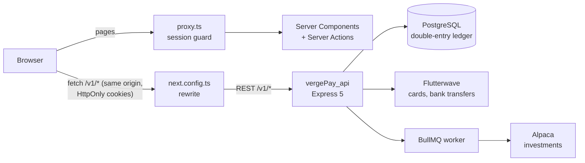
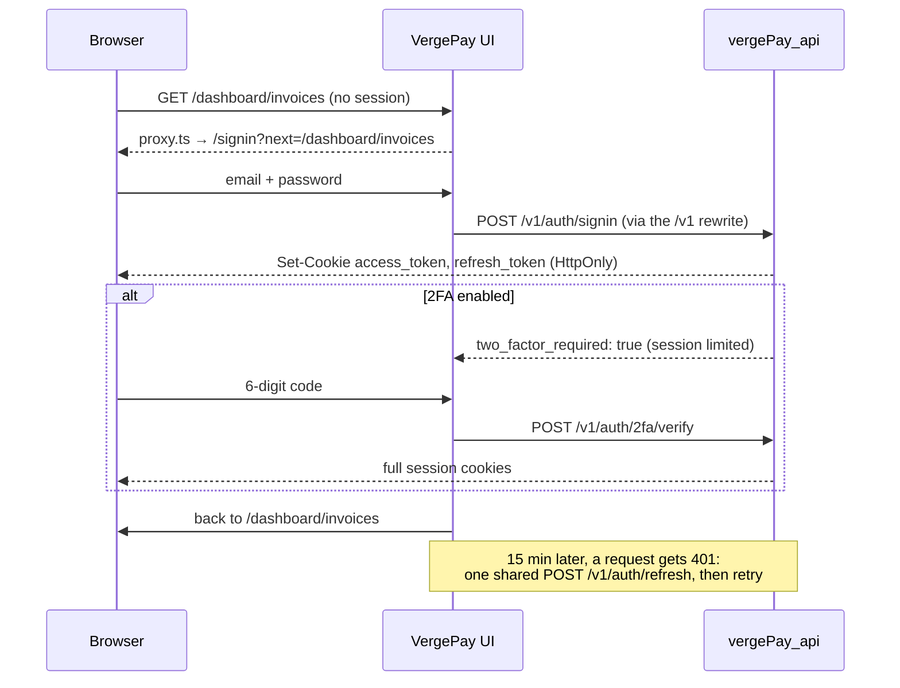

# VergePay UI

**The web dashboard for VergePay, a fintech platform for Nigerian freelancers and small businesses. One screen shows personal and business money side by side: wallets, invoices, recurring billing, client payment health, expenses, payroll, savings goals and budget envelopes.**


Built by **[Seyitan Omodara](https://github.com/dunascode-prog)** · Backend: [vergePay_api](https://github.com/dunascode-prog/vergePay_api)

> **Project status.** All 10 sections of the app (16 routes) are designed and built. Sign-up and sign-in call the real API. The other screens still show realistic sample data while they're connected to the backend one feature at a time; see [Connecting to the API](#connecting-to-the-api). The backend is finished and tested: 56 endpoints and 664 passing Postman assertions.

---

## At a glance

| | |
|---|---|
| **What it is** | A dashboard for freelancers and small businesses to run personal and business money in one place |
| **Screens** | 16 routes in 10 sections: overview, analytics, invoices (list, new, detail, edit, reminder), recurring billing, clients, business overview, expenses, payroll, goals, envelopes |
| **Stack** | Next.js 16 (App Router), React 19, TypeScript, Tailwind CSS 4, shadcn/ui on Base UI, Recharts, React Hook Form + Zod |
| **Rendering** | Server Components by default. Client Components only where there's interaction. Server Actions for forms |
| **Money** | Naira and US dollars kept separate and never blended at an invented exchange rate. Formatted per locale with `Intl.NumberFormat` |
| **Auth model** | HttpOnly cookie sessions set by the API. The browser's JavaScript never holds a token. Refresh and route guarding are handled for you |
| **Backend** | [vergePay_api](https://github.com/dunascode-prog/vergePay_api): Express 5 + PostgreSQL, with a double-entry ledger, Flutterwave payments, TOTP 2FA and Alpaca investments |

---

## Why VergePay

A Nigerian freelancer usually has a personal account, a business account, a few clients who pay late, retainers that renew every month, and a spreadsheet trying to hold it all together. Banking apps show balances. They don't answer the questions that matter:

- *Who owes me money, and are they likely to pay on time?*
- *How much of this month's income is actually mine after expenses, tax and savings?*
- *Is my business healthier than it was three months ago?*

VergePay answers those on one screen. This repository is that screen. The backend moves the money; this app turns it into decisions.

---

## Screens

The sidebar groups the app the way a small-business owner thinks about their money.

### Account
| Screen | Route | What it shows |
|---|---|---|
| **Sign in** | `/signin` | A split layout in the style of fintech sign-in pages: a focused form on the left, and a brand panel on the right that disappears on phones. Email and password with a show/hide toggle; a **two-factor code step** for accounts with 2FA on; clear inline errors; and a return to the page you were trying to open |
| **Sign up** | `/signup` | The same split layout. Username, email and password, with a **live password checklist** (12+ characters, upper and lowercase, a number, a special character) that ticks off as you type. Server errors such as "username already exists" show on the field they belong to |
| **Create your wallet** | `/onboarding` | Right after sign-up: choose a Personal or a Business wallet, and NGN or USD. The dashboard stays locked until the first wallet exists, and the other can be added later |

### Main
| Screen | Route | What it shows |
|---|---|---|
| **Overview** | `/dashboard` | **Live from the ledger.** Every customer has up to two wallets, a **Personal** and a **Business** one, and the **Personal / Business / Combined** toggle shows one, the other, or both. A performance card (income, spent and net this month, and the balance, each compared with last month, with six-month sparklines), the wallet cards (balance, currency, copyable account number, or "Add a business wallet" if it's missing), a six-month income-vs-spending chart and the latest transactions (*Personal wallet → Business wallet*). An **Investments** card links Alpaca and then shows synced holdings. A reminder to link comes back every 3 days until they do. Widgets whose features aren't connected yet (AI insight, client health, upcoming billing, outstanding invoices, goals, budgets) follow the toggle and are tagged **Sample data** |
| **Move money** | wallet card actions | **Add money** by bank transfer (a permanent account number for the wallet) or debit card (linked once through Flutterwave's hosted checkout, then one-tap top-ups, with 3-D Secure handled). **Send** to any VergePay wallet after a name check ("Ada Obi"), with a review screen and receipt. **Transfer** between your own personal and business wallets. The first time money moves, a one-time **identity check** (BVN, legal name, date of birth) runs inside the same dialog, and 2FA is turned on when linking a card needs it |
| **Analytics** | `/dashboard/analytics` | Revenue trend, client revenue share and concentration risk, cash-flow forecast, collection metrics, late-payment ageing, how effective reminders are, and a feed of AI insights. Filter by this month, the last 3 months or this year |

### Payments
| Screen | Route | What it shows |
|---|---|---|
| **Invoices** | `/dashboard/invoices` | Filterable table of draft, sent, partial, paid and overdue invoices. Each has a **predicted chance of on-time payment** and the client's health score |
| **New / edit invoice** | `/dashboard/invoices/new`, `/[id]/edit` | Invoice form with client, description, amount, currency, and issue and due dates |
| **Invoice detail** | `/dashboard/invoices/[id]` | Status, amount paid so far, payment history and the ledger entries behind the invoice |
| **Send reminder** | `/dashboard/invoices/[id]/remind` | Compose a payment reminder for an unpaid invoice |
| **Recurring billing** | `/dashboard/recurring`, `/new`, `/[id]` | Retainers and subscriptions: pause, resume or cancel, next billing date, invoices generated, and the monthly equivalent of weekly, quarterly and yearly plans |
| **Clients** | `/dashboard/clients` | Client cards with health score, average days to pay, on-time rate, total revenue, and VIP and new tags. A detail sheet and an AI note on each client |

### Business
| Screen | Route | What it shows |
|---|---|---|
| **Business overview** | `/dashboard/business` | A business health score and the factors behind it, a ledger snapshot (cash, receivables, revenue and expenses year to date), revenue vs. expenses, top clients, recurring revenue, and a **"needs attention"** list that links straight to the problem |
| **Expenses** | `/dashboard/expenses` | Expense table with category breakdown and trend. Flags recurring expenses and **missing receipts** |
| **Payroll** | `/dashboard/payroll` | Payees (salary or contract), pay frequency and bank details (masked). A payroll run shows gross, PAYE, pension and net, and writes each payment to Expenses automatically |

### Wealth
| Screen | Route | What it shows |
|---|---|---|
| **Goals** | `/dashboard/goals` | Savings goals with progress, contributions, and a **pace check** that says whether you'll hit the deadline at your current rate |
| **Envelopes** | `/dashboard/envelopes` | Budget envelopes that you fund from and withdraw back into your wallets, with spent and remaining amounts for each |

Every feature page follows the same layout: a header with actions, summary cards, the main grid or table, an "add" dialog, and an AI insight banner. Once you've used one page, you know how to use them all.

---

## Engineering highlights

### Server-first rendering
Pages are **React Server Components** by default. They read their data on the server and send finished HTML, so the dashboard's charts and tables don't wait on a client-side fetch. Components are marked `"use client"` only where there's real interaction: toggles, dialogs, forms and charts. Mutations such as creating a client, logging an expense, running payroll or pausing a plan are **Server Actions** (`app/(protected)/dashboard/*/actions.ts`). They refresh only the page they changed.

### A security model that keeps tokens away from JavaScript
The API issues the session as **HttpOnly, `SameSite=Strict` cookies**, so no script on the page, including an injected one, can read the access or refresh token. The UI stores nothing itself: no `localStorage`, and no token in React state.
- **Same-origin by design.** The browser calls `/v1/*` on the UI's own origin, and a rewrite in `next.config.ts` forwards it to the API. The session cookies are therefore first-party to the app in every environment, with no CORS and no cross-site cookies. The API's address (`API_URL`) is server-only.
- **Silent refresh, exactly once.** The access cookie expires with its 15-minute token. When a data request then gets a 401, `lib/api.ts` refreshes the session and retries.
  - Refresh tokens are single use, so parallel requests **share one refresh** instead of racing, which would sign the user out.
  - Auth endpoints are excluded, so a wrong password never triggers a refresh.
  - If the refresh fails, the user goes to `/signin?next=…` and returns to the same page afterwards.
- **`proxy.ts`** (Next.js 16's replacement for middleware) runs before any `/dashboard` route renders. It does a fast cookie check and never contacts the API:
  - no session → `/signin?next=…`
  - password accepted but 2FA code not yet entered → the code step
  - already signed in → `/signin` and `/signup` redirect to the app

  It reads the token's claims **without verifying them**, because the UI deliberately doesn't hold the API's signing key. That's safe because the proxy only decides where to send someone. Every piece of data is still authorised by the API itself.
- **No open redirects.** `?next=` only accepts same-site paths, so `?next=//evil.example` goes to `/dashboard`.
- **Two-factor sign-in.** For accounts with TOTP 2FA on, the password alone gives a limited session that the API refuses for any data. The sign-in form moves to a 6-digit code step (with `autocomplete="one-time-code"`), and a valid code upgrades the session. "Use a different account" revokes the limited session.

### Two wallets, one view
A customer has **at most one personal and one business wallet**; the API refuses a third. Sign-up leads straight to creating the first one. The Personal / Business / Combined toggle maps exactly onto them, so personal spending and business money never blur together. Investments sit in their own optional card: the investment wallet behind them is opened by the API when the customer links Alpaca, and it never shows up as a wallet.

### A dashboard computed from the ledger
The overview has no summary endpoint to trust: it's worked out in the browser from each account's ledger lines, by small pure functions in `lib/ledger.ts`.
- **Scope in the URL.** Personal, Business or Combined is `?scope=`, so the toggle, the sidebar and the page always agree, and a refresh or a shared link keeps the view.
- **Moving money between your own accounts isn't income.** A ₦40,000 move from personal to business is spending in the Personal view and income in the Business view, but in Combined it's neither. The test suite checks exactly those numbers.
- **Balances over time, worked backwards.** Each month's closing balance comes from today's balance, subtracting each month's movements.
- **One currency at a time.** Naira and dollars are never summed. With both, a currency switch appears.
- **Charts built to be read.** Income and spending are a colour pair checked for colour-blind separation and 3:1 contrast in light and dark mode, the chart has a legend and a screen-reader table, and a sparkline only appears once there are two months of data to draw.

### Moving money safely
Every money action is built so that a retry or a double-tap can't pay twice, and so that you see exactly what will happen before it does.
- **Idempotency keys on every attempt.** Each Send, Transfer, top-up and card link carries its own `Idempotency-Key`, so a flaky connection that retries replays the same result instead of moving money again.
- **Name enquiry before paying.** The recipient's name comes from the API before you confirm. Your own wallets are caught ("use Transfer"), and so are currency mismatches.
- **Review, then receipt.** Amount, fee (free), note and destination are shown before sending, then a receipt with a short reference.
- **Cards never touch VergePay.** Card details are typed on Flutterwave's page. After checkout or 3-D Secure, the return page asks the API, which verifies with Flutterwave itself, rather than trusting the redirect.
- **Identity and 2FA in the flow, not a detour.** The one-time BVN check waits for the (asynchronous) verdict and carries straight on. Adding a card turns 2FA on if needed, using the same step as brokerage linking.

### A dashboard that updates itself
When someone sends you money, your balance, charts and history update, a toast says who sent what, and the bell counts it, all without a reload ([`components/realtime/LiveUpdates.tsx`](components/realtime/LiveUpdates.tsx), [`components/notifications/NotificationBell.tsx`](components/notifications/NotificationBell.tsx)).
- **One WebSocket, same session.** It connects to `/v1/ws` on the app's own origin, and the `/v1` rewrite forwards the upgrade to the API. The HttpOnly session cookie goes with it, so JavaScript still never touches a token.
- **Expiry handled quietly.** The API closes the socket (`4401`) when the short-lived access token expires. The client refreshes the session through the same shared `refreshSession()` as HTTP and reconnects.
- **Nothing lost offline.** It reconnects with backoff, straight away when the network or the tab comes back, and then re-reads balances and alerts. The API's notification list is the durable copy; the socket only makes it instant.
- **Toasts only for what you didn't do yourself:** money in and identity decisions. Your own sends just appear in the bell. Reading an alert in one tab clears the badge in the others.

### Money shown honestly
Totals in different currencies are **never added together**. A client paying ₦620,000 and $1,400 is shown as `₦620,000 + $1,400`, not as a single naira figure based on a guessed exchange rate (`lib/format.ts`). Amounts use locale formatting (`en-NG`, `en-US`). The API stores all money as integer minor units (kobo and cents), so no floating-point error ever reaches the screen.

### Forms that validate before the round trip
Forms use **React Hook Form with Zod schemas** whose rules match the API's. For example, sign-up requires a password of at least 12 characters with mixed character types, plus a matching confirmation. Mistakes show up right away, next to the field. If the API still rejects something, its structured error lands on the right input rather than in a generic toast: a conflict names the field (`"username already exists"`), and a validation error lists messages per field. `lib/api.ts` turns both into form errors through `ApiError.fieldErrors()`.

### A typed domain model
Every concept on screen has a TypeScript type in `types/`: `Invoice`, `ClientProfile`, `RecurringPlan`, `Expense`, `Payee` and `PayrollPayment`, `Goal`, `Envelope`, `LedgerSnapshot`, and the analytics series. Invoices carry their own ledger entries and payment records, matching how the backend's double-entry ledger records them. Replacing the sample data with API responses is then a change of data source, not a redesign.

### Business rules kept out of components
Calculations live in small, pure modules in `lib/` rather than inside JSX:
- `recurring-math.ts`: the monthly equivalent of any billing frequency
- `goal-pace.ts`: whether a goal is on track for its deadline at the current contribution rate
- `expense-category.ts`: category totals from line items, with colours shared across Analytics, Business and Expenses so a category looks the same everywhere
- `format.ts`: currency formatting and per-currency sums

### Accessible components, dark mode
The UI is built on **shadcn/ui over Base UI** primitives, so dialogs, dropdowns, sheets, tabs and tooltips handle focus, keyboard navigation and ARIA roles properly. The theme is made of CSS variables in Tailwind 4, with light and dark modes via `next-themes`. The sidebar collapses, remembers its state in a cookie, and becomes a sheet on mobile.

---

## Architecture



### Sign-in flow



---

## Connecting to the API

The screens were designed first, using sample data shaped like the real domain. They're now being connected to the finished backend one feature at a time. Each step is a small, reviewed pull request.

| Area | Screens | API endpoints | Status |
|---|---|---|---|
| Sign-up and sign-in | `/signup`, `/signin` | `POST /v1/auth/signup`, `/signin` | ✅ Connected |
| Session, 2FA, sign-out | `proxy.ts`, sign-in, user menu | `/v1/auth/refresh`, `/2fa/verify`, `/logout`, `/v1/users/me` | ✅ Connected |
| Wallets and overview | `/onboarding`, `/dashboard`, sidebar wallets, greeting | `GET`/`POST /v1/accounts` (one personal and one business wallet), `/:id/transactions` | ✅ Connected |
| Add money, Send, Transfer, identity | wallet-card actions, `/dashboard/payments/complete` | `POST /v1/kyc/submissions`, `/v1/accounts/lookup`, `POST /v1/transactions`, `/v1/cards` (link, charges), `/v1/accounts/:id/virtual-account`, `/v1/transactions/:id/sync` | ✅ Connected |
| Notifications and live updates | top-bar bell, toasts, the whole dashboard | `GET /v1/notifications`, `/:id/read`, `/read-all`, WebSocket `/v1/ws` | ✅ Connected |
| Invoices | `/dashboard/invoices/*` | `/v1/invoices`, `/:id/pay`, `/:id/cancel` | ⏳ Planned |
| Investments | dashboard Investments card, link reminder, `/dashboard/investments/linked` | `POST`/`GET /v1/brokerage-links` (opens the investment wallet), `/v1/holdings`, `/v1/auth/2fa/enable` + `/verify` | ✅ Connected |
| Loans | new screen | `/v1/loans`, `/:id/schedule`, `/:id/repayments` | ⏳ Planned |
| Clients, recurring, expenses, payroll, goals, envelopes, analytics | their pages | none yet; the backend doesn't have these features | 🎨 Designed, sample data |

---

## Project structure

```
vergepay/
├── app/
│   ├── layout.tsx                  # root layout, fonts, metadata
│   ├── (home)/                     # landing / get started
│   ├── (public)/signin, signup/    # auth pages
│   └── (protected)/dashboard/      # the app: one folder per screen
│       ├── layout.tsx              # sidebar + top bar + theme
│       ├── invoices/[id]/edit, remind/
│       ├── recurring/[id], new/
│       └── clients, business, expenses, payroll, goals, envelopes, analytics/
│           └── actions.ts          # Server Actions for that screen
├── components/
│   ├── ui/                         # shadcn/ui primitives on Base UI
│   └── business, clients, expenses, payroll, goals, envelopes, recurring/
│                                   # feature components: header, cards, grid, dialog, AI banner
├── lib/                            # API client, formatting, pure business rules
├── services/                       # API calls grouped by feature (auth, …)
├── types/                          # the domain model
├── data/                           # sample data used until each screen is connected
├── hooks/                          # use-mobile
├── public/                         # logos and static assets
└── proxy.ts                        # route guard for /dashboard (Next.js 16)
```

---

## Getting started

### Prerequisites
- **Node.js 20.9 or newer** (22 LTS recommended)
- The **[vergePay_api](https://github.com/dunascode-prog/vergePay_api)** backend running on `http://localhost:8000`. Its README covers setup. CORS needs no configuration, because the browser only ever talks to the UI's origin.

### Install and run

```bash
git clone https://github.com/dunascode-prog/vergePay_ui.git
cd vergePay_ui
npm install
```

Copy `.env.example` to `.env.local`:

```env
# Where the VergePay API runs. Server-only: the browser calls /v1/* on this
# app, and next.config.ts forwards it here.
API_URL=http://localhost:8000
```

> This app needs **no secrets**. The API issues and verifies sessions, and its JWT signing keys belong only in the API's own `.env`.

```bash
npm run dev
```

Open [http://localhost:3000](http://localhost:3000), create an account at `/signup`, and sign in.

### Scripts

| Command | What it does |
|---|---|
| `npm run dev` | Development server with hot reload |
| `npm run build` | Production build |
| `npm start` | Serve the production build |
| `npm run lint` | ESLint with the Next.js rules |

---

## Roadmap

- [x] Dashboard shell: sidebar, top bar, light and dark themes, mobile layout
- [x] Personal / Business / Combined views
- [x] All 10 sections designed and built: invoices, recurring billing, clients, business overview, expenses, payroll, goals, envelopes, analytics
- [x] Sign-up and sign-in against the real API
- [x] Clean production build (`next build` with strict TypeScript, zero errors) and every in-app link resolving to a real route
- [x] Route guard, 2FA sign-in step, silent session refresh and sign-out
- [ ] Security settings: turn 2FA on or off from the app
- [x] Wallets, balances, cash flow and transaction history from the ledger, per Personal / Business / Combined
- [x] Add money (bank-transfer account number, or a linked card via Flutterwave), Send with a name check, Transfer between your wallets, and one-time identity verification (BVN)
- [x] Live dashboard: balances update the moment money moves, a notification bell, and toasts for money in
- [ ] Invoices on the real API: create, pay, cancel
- [x] Investments: link Alpaca (with 2FA set up on the way), synced holdings, a reminder until linked
- [ ] Loans: apply, view the repayment schedule, repay
- [ ] Remove leftover sample data and unused components
- [ ] Deployment

---

## Related

- **Backend:** [vergePay_api](https://github.com/dunascode-prog/vergePay_api). The money engine: a double-entry ledger, idempotent payments, Flutterwave, TOTP 2FA, Alpaca investments, and a 412-request Postman suite

---

## Author

**Seyitan Omodara**, full-stack and fintech developer. [GitHub @dunascode-prog](https://github.com/dunascode-prog)
